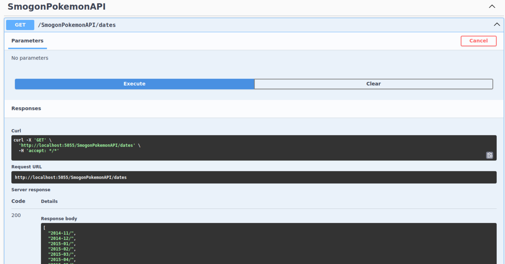

# SmogonStatsAPI

This API serves as a way to get information from the somewhat jumbled Chaos stats page from Smogon, it contains Format battle data, providing a way to perform analytics, either for overall showcase of viability to perhaps using it to train a Pokemon ML Model.

This is for whoever wishes to do Pokemon projects and requires battle data to do so.


## Screenshots




## API Reference

#### Get all dates

```http
  GET /SmogonPokemonAPI/dates
```

| Parameter | Type     | Description                |
| :-------- | :------- | :------------------------- |
| `None` | `None` | Gets all dates available |

#### Get all formats

```http
  GET /SmogonPokemonAPI/formats
```

| Parameter | Type     | Description                       |
| :-------- | :------- | :-------------------------------- |
| `date`      | `string` | **Required**. Gets all formats based on provided date |

#### Get all pokemon data

```http
  GET /SmogonPokemonAPI/alldata
```

| Parameter | Type     | Description                       |
| :-------- | :------- | :-------------------------------- |
| `date`      | `string` | **Required**. Gets all data based on date and format provided, data is also paginated |
| `format` | `string`                          |
| `pageNumber` | `string`|Optional                          |


#### Get all pokémon data, of specified pokémon

```http
  GET /SmogonPokemonAPI/pokemondata
```

| Parameter | Type     | Description                       |
| :-------- | :------- | :-------------------------------- |
| `date`      | `string` | **Required**. Gets all data based on date,format and pokémon provided. |
| `format` | `string`  |**Required**.|
| `selected` | `string`|**Required**.|


## Authors

- [@Mike](https://www.github.com/xMikeTR)


## Installation

Clone to your local

```bash
  dotnet run
```
    
## License

[MIT](https://choosealicense.com/licenses/mit/)

